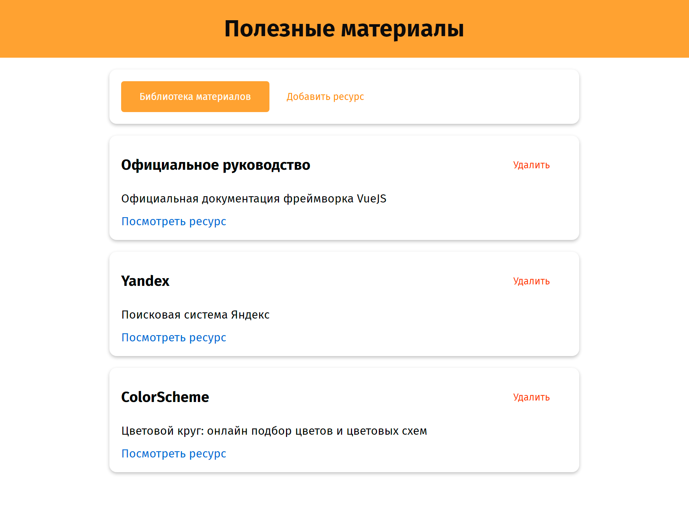
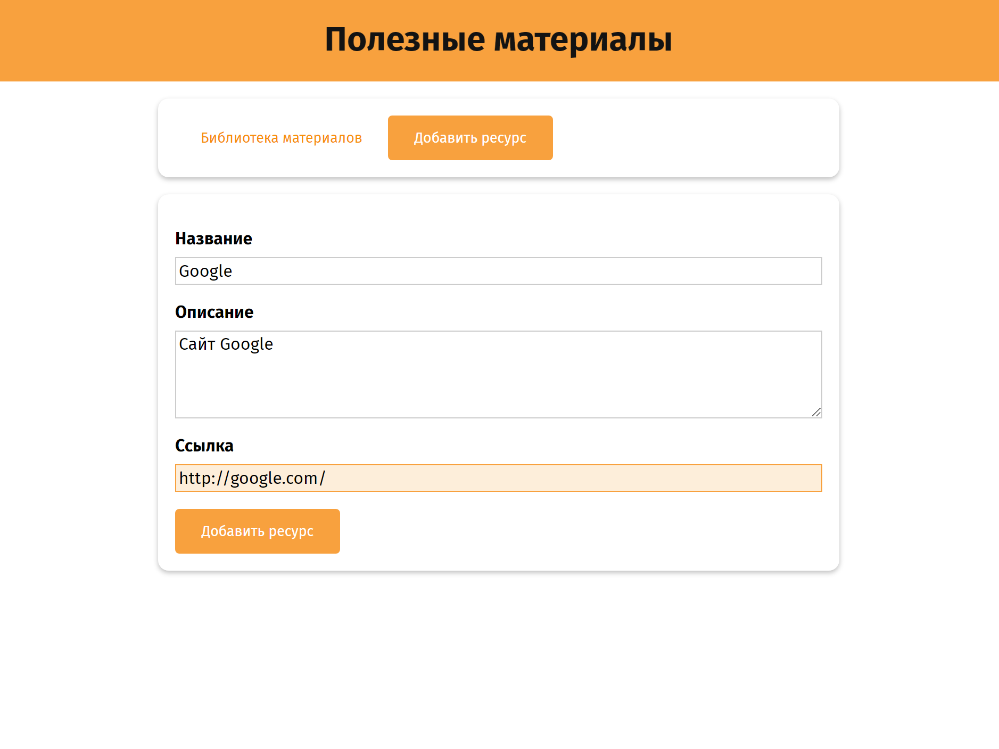

# Приложение "Полезные материалы"

Обучающее приложение-библиотека, при разработке которого изучены основы компонентов, входные параметры компонентов, пользовательские события, слоты, provide/inject концепция, refs, телепорты и кеширование компонентов (keep-alive).

### Особенности проекта

- Переключение вкладок (список материалов, добавление ресурса) через динамический компонент
- Добавление ресурса (название, описание, ссылка)
- Удаление ресурса
- Сохранение введенных данных при переключении вкладок

### Скриншоты

|               Список материалов                |                   Добавление ресурса                   |
| :--------------------------------------------: | :----------------------------------------------------: |
|  |  |
